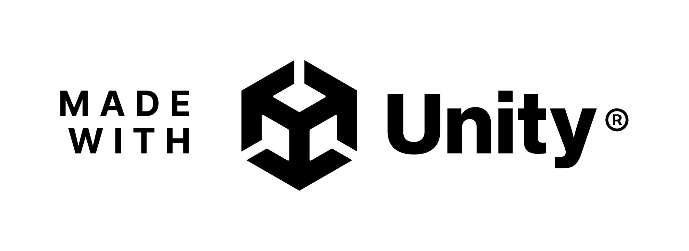

# 브로셔

<aside>

## 목차

1. [프로젝트 결과물 소개](https://www.notion.so/1ff9fd2d96e480d6b200c96020197fa2?pvs=21)
    
    [🎮 프로젝트 소개](https://www.notion.so/1ff9fd2d96e480d6b200c96020197fa2?pvs=21)
    
    [🎬 시연 영상](https://www.notion.so/1ff9fd2d96e480d6b200c96020197fa2?pvs=21)
    
2. [기획](https://www.notion.so/1ff9fd2d96e480d6b200c96020197fa2?pvs=21)
    
    ✅ 장르: 3D FPS (멀티지원)
    
    ✅ 스토리
    
    ✅ 마일스톤
    
3. [사용한 기술 스택](https://www.notion.so/1ff9fd2d96e480d6b200c96020197fa2?pvs=21)
4. [게임 사이클](https://www.notion.so/1ff9fd2d96e480d6b200c96020197fa2?pvs=21)
5. [기술적인 도전 과제](https://www.notion.so/1ff9fd2d96e480d6b200c96020197fa2?pvs=21)
6. [사용자 개선 사항](https://www.notion.so/1ff9fd2d96e480d6b200c96020197fa2?pvs=21)
7. [게임하러 가기](https://www.notion.so/1ff9fd2d96e480d6b200c96020197fa2?pvs=21)
8. [팀원 구성 및 연락처](https://www.notion.so/1ff9fd2d96e480d6b200c96020197fa2?pvs=21)
</aside>

## 1. 프로젝트 결과물 소개

.png)

[https://www.youtube.com/watch?v=8iMhTAiVd2Y](https://www.youtube.com/watch?v=8iMhTAiVd2Y)

---

## 2. 기획

### ✅ 장르: 3D FPS (멀티지원)

- 게임 이름: INFEST (인페스트)
- 장르: FPS + 좀비
- 타겟 유저: FPS 혹은 좀비 아포칼립스를 선호하는 게이머 (10 ~ 30대), 협력 게임을 좋아하는 게이머
- 사용 엔진: Unity 2022.3.17f
- 출시 목표 플랫폼: STOVE, Steam

### ✅ 시놉시스

<aside>

시놉시스

</aside>

NEXA 바이오테크의 실험 도중 핵융합 발전기 폭발로 연구소 전체가 방사능에 노출되고, 인간형 실험체에 주입된 **Code-NX 바이러스** 가 변이되어 통제 불가능한 좀비 사태로 번지게 된다.

감염된 구역에서 생존하고, 위협적인 보스를 추적하게 된다.

### ✅ 마일스톤

- 개발 기간 : `2025.04.04 ~ 2025.05.30`
- 타임라인
    
    
    | 1주차 | S.A 작성, Fusion2 R&D, 프레임워크 작업 |
    | --- | --- |
    | 2주차 | 플레이어 조작(이동, 공격, 조준, 사망) |
    | 3주차 | 무기 구현(보조무기, 주무기), 몬스터 구현(소환, 이동, 공격, 사망) |
    | 4주차 | 중간발표용 MVP 제작 |
    | 5주차 | 플레이어 조작 개선 |
    | 6주차 | 몬스터 추가 (일반형 몬스터, 엘리트 몬스터, 보스 몬스터) |
    | 7주차 | 유저 피드백 기반 버그 수정(밸런스 패치, UI 개선, 전투시스템 개선) |
    | 8주차 | 몬스터 AI 개선, 이펙트(연출) 개선 |

---

## 3. 사용한 기술 스택

<aside>

</aside>

<aside>

</aside>

<aside>

</aside>

✅ 프레임워크 & 언어

- C#
- .Net 8.0

✅ 개발환경

- Visual Studio 2022
- Window 10 & 11

✅ 데이터 관리

- Json

---

## 4. 게임 사이클

---

## 5. 기술적인 도전 과제

<aside>
💡

### 기술 모음

- **Host-Client(S2P) 구조의 게임 플레이**
    
    
    
    발단:
    
    - 좀비가 50마리 스폰되고, 4명의 플레이어가 복잡한 컨트롤 로직을 보유하고 있는 무거운 환경에서 어떤 네트워크 방식을 써야할까?
    
    결과:
    
    - 복잡한 네트워크 환경을 한 명이 관리하는 중앙 관리 체계의 Host-Client를 채택함으로써 네트워크 환경 제어를 수월하게 하였다.
- **Shared(P2P) 구조의 매칭 시스템**
    
    
    
    발단: 
    
    - Host-Client(S2P)로 매칭하면, Host가 나갔을 때 매칭이 끊긴다.
    
    시도: 
    
    - Host Migration : 호스트 권한을 이전 후 정보를 유지한 채 세션을 다시 만드는 방법.  그러나 이 과정을 거치지 않아도 되는 Shared 방식이 있기에 기각.
    
    결과: 
    
    - Shared(P2P)로 매칭. 후에 Stage로 씬을 전환하며 세션에 접속한 유저들이 Host-Client로 재연결된다. 이 때 MasterClient가 Host의 역할을 한다.  세션을 전환하는 와중에  MaterClient 권한이 이전되면서 Host가 두 명 이상이 되는 문제가 발생할 수 있는데, RPC를 이용해 모든 유저가 자신의 권한을 확정 지은 다음에 세션을 전환되도록 하여 해결하였다.
- **InputAction을 활용한 네트워크 입력 수집 및 제어**
    
    GetKey계열의 함수를 쓰면 Update에서 매 프레임마다 호출되는 반면
    
    InputAction은 이벤트 기반이라 매프레임마다 호출하지 않아 효율적이다
    
- **보간과 예측을 활용한 향상된 클라이언트 움직임**
    
    발단: 
    
    - 클라이언트의 움직임이 네트워크를 거치면서 움직임이 부드럽지 않게 되었다.
    
    결과:
    
    - 에측과 보간으로 부드러운 움직임을 동기화했다.
- **bool값 동기화를 활용한 애니메이션 동기화.**
    
    발단:
    
    - 네트워크 데이터 전송량이 1280byte가 권장되는 와중에, 애니메이션 동기화에 최소한의 데이터만 사용해야 했다.
    
    시도:
    
    - RPC는 기본 8 ~ 10byte의 네트워크 데이터를 차지하고, 변수에 따라 추가적인 데이터가 필요해서 다른 방법을 물색.
    
    결과:
    
    - 1byte의 bool 데이터를 동기화 해서 이 값이 변경될 때 애니메이션을 실행시키는 Event 형식으로  애니메이션 로직 실행.
- **FSM과 CRTP를 활용한 확장성 높은 몬스터 구조**
    
    발단:
    
    - 하나의 큰 틀 속에서 빠르게 개발이 가능하게, 그리고 최대한 많은 개성을 넣을 수 있게 하는 구조가 필요했다.
    
    결과:
    
    - 몬스터 네트워크 로직(이동/피격 판정 등)을 최상위 class에서 미리 정의
    - 몬스터의 이동/공격/죽음 등을 FSM으로 관리
    - 몬스터마다 차별화된 메인 로직을 구현할 수 있도록 CRTP 패턴 적용
- **NavMesh의 네트워크 동기화**
    
    발단:
    
    - 몬스터의 움직임을 어떻게 네트워크에 동기화할까?
    
    시도:
    
    - 몬스터의 목적지만 네트워크에 동기화한 후, Local에서 이동시켜봤다.
        - 뒤늦게 들어온 플레이어는 Local에서의 이동 알고리즘이 작동하지 않은 상태였기 때문에 오차가 크다.
        - 이를 비롯한 모든 변수를 제어하기에는 시간이 부족해서 다른 방법을 찾아보았다.
    
    결과:
    
    - 몬스터 객체의 Transform을 Tick마다 동기화. 몬스터마다 x, y 좌표값과 y 회전값 총 3 개의 float를 동기화해 12byte의 네트워크 전송량을 차지하게 되었다.
- **Analytics를 활용한 유저 데이터 수집**
    
    발단:
    
    - 개발진들만으론 알 수 없는 유저 경험을 어떻게 알 수 있을까?
    
    결과:
    
    - Unity Analytics 적용. 유저들의 플레이 데이터를 분석해 게임의 장 단점 파악 후 개선하는 근거 자료로 활용.
- **UI 동적 생성**
    
    필요할 때만 UI를 생성하고, 사용하지 않으면 풀에 반환하거나 비활성화해서 메모리나 성능 최적화에 유리하기 때문에
    
- **LagCompensation Raycast와 Hitbox 이용한 몬스터 피격처리**
    
    네트워크 환경에서 정확도와 공정성을 확보하기 위해
    
- **Light baking과 Occlusion Culling을 이용한 최적화**
    
    실시간 라이트 + 렌더링 비용 대폭 절감
    
- **Fusion의 [Networked], RPC을 활용한 네트워크 동기화**
    
    [Networked] 
    
    해당 속성으로 선언한 변수는 변수가 호출됐을때, 자동으로 동기화가 된다.
    
    Ex) [Networked] public int curMagazineBullet
    
    RPC
    
    함수 실행을 호출하여 동기화 시켜주는 방법이다.
    
    Ex) [Rpc(RpcSources.InputAuthority, RpcTargets.All)] public void RPC_####()
    
    RpcSources : 호출하는 주체 // RpcTargets : 호출받은 대상
    
</aside>

---

## 6. 사용자 개선 사항

<aside>
💡

### 피드백 모음

- **슈류탄, 치유아이템,등등 서브아이템의 존재를 죽고나서 알았습니다. 눈에 안뛰는것같아요**
    
    UI를 추가하여 본인이 어떤 종류의 아이템을 몇개 가지고 있는지 표시
    
    
    
- **공원으로 이동하라는데 어디가 공원인지 명확하지 않습니다.(화살표 안내 있으면 좋을듯)**
    
    맵에 화살표(WayPoint)를 배치하여 다음 장소를 표시
    
    
    
- **크로스헤어가 있으면 좋겠습니다.**
    
    크로스헤어를 추가하여 플레이어가 쏜 총알이 어디로 날아갈지 표시
    
    
    
- **닉네임을 입력해주세요에서 닉네임 입력할때 회색보다 밝은색으로 하는게 좋을 것 같아요**
    
    닉네임 입력 시 어두운 색에서 밝은 색으로 변경
    
    
    
- **상점 판매 구매 UI 구분안됨(튜토리얼 안내되어도 위에 구매나 판매표시 있어야할듯)**
    
    기존: 판매/구매 텍스트 X
    
    변경 후: 판매/구매 탭을 구별할 수 있는 텍스트 추가
    
    
    
    변경 후 상점 UI
    
- **상점 이용중에는 게임이 일시정지 되었으면 좋겠습니다.**
    
    상점과 상호작용 후, 화면 고정 (창 닫으면 고정 해제)
    
    
    
    상점 마우스 화면 고정 적용
    
- **시계탑 꼭대기에 아무것도 없습니다.**
    
    시계탑 및 배(선박)에 미스테리 박스를 추가하여 인 게임 내 콘텐츠 추가 예정…
    
</aside>

---

## 7. 게임하러 가기

### ➡️ Web(튜토리얼만 가능): [접속하기](https://play.unity.com/en/games/3edeedf2-de01-4374-88a0-69c5d316ea6d/infestwebbuild-only-tutorial)

### ➡️ Download Link: [접속하기](https://drive.google.com/drive/folders/1Z0sOGmJ4OTf9CryglPao0jDQUkxqyn4x)

---

## 8. 팀원 구성 및 연락처

[제목 없음](%EC%A0%9C%EB%AA%A9%20%EC%97%86%EC%9D%8C%201ff9fd2d96e48097835fe6d71a9ff764.csv)

[팀 소개](%ED%8C%80%20%EC%86%8C%EA%B0%9C%202029fd2d96e480949507dbf31ade43de.csv)